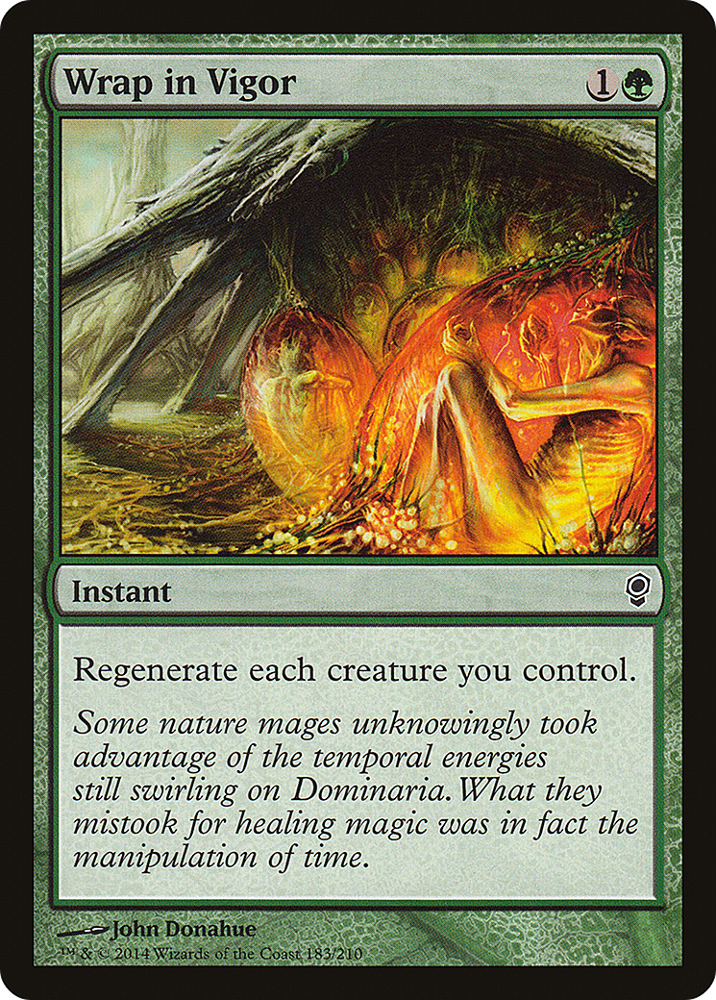
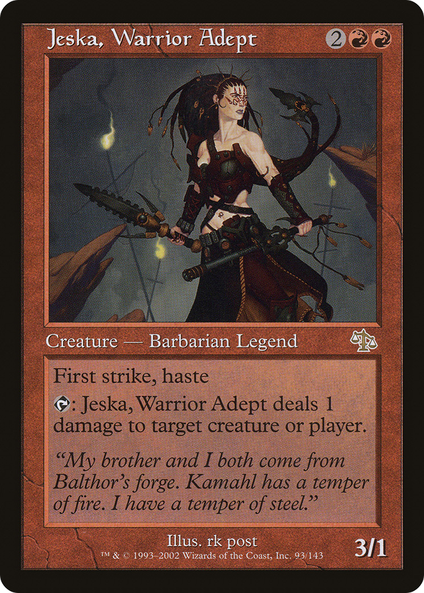
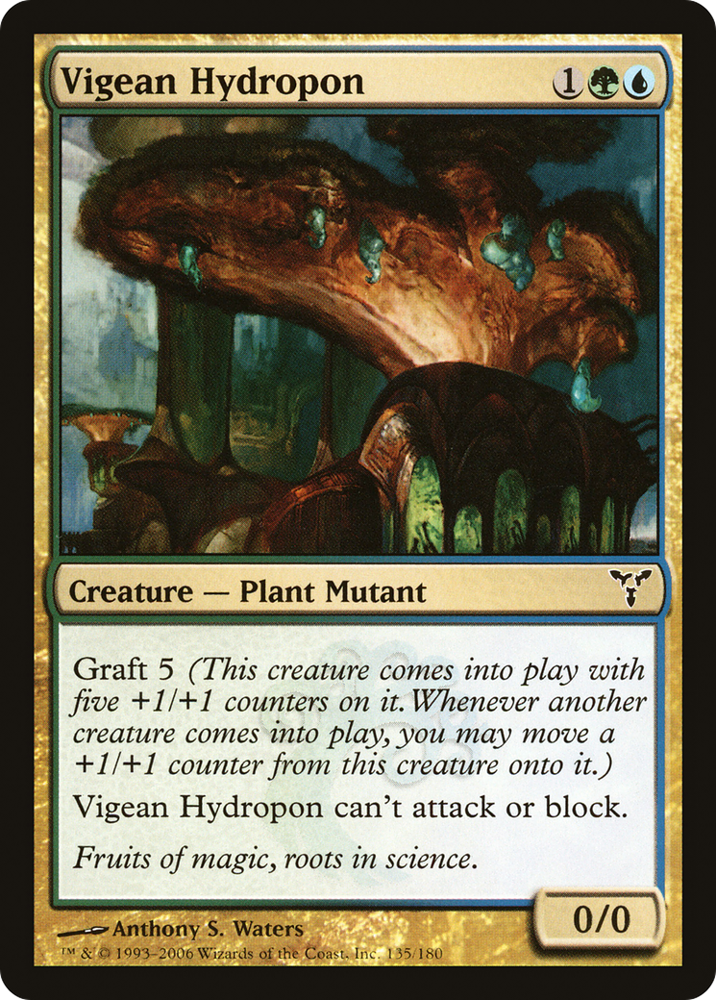
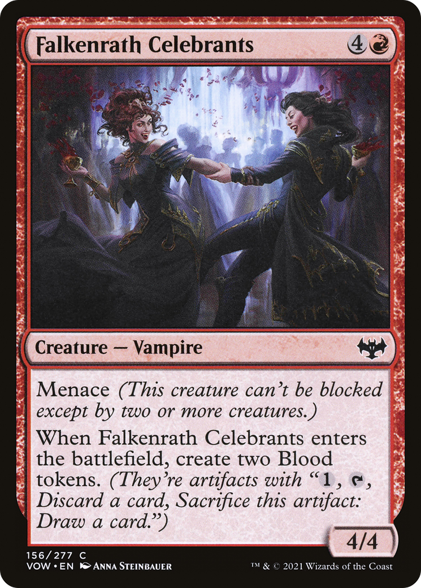
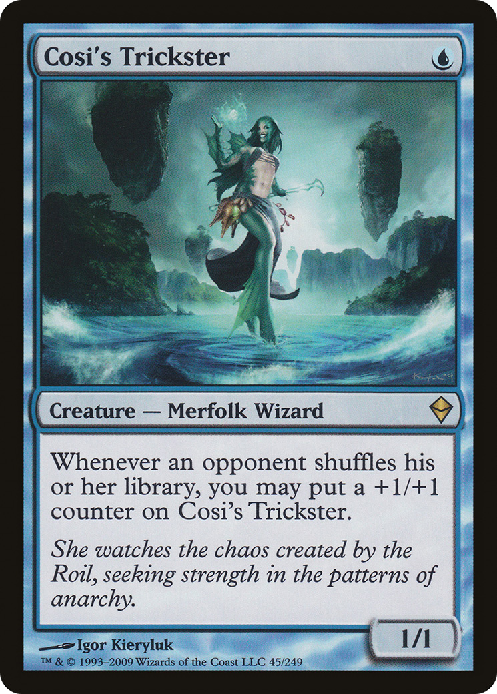
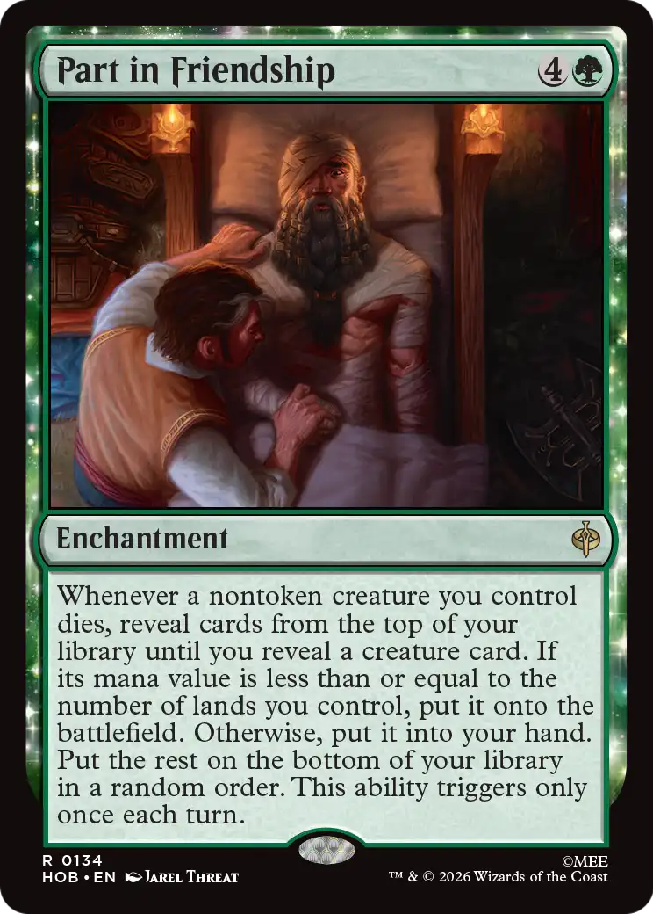
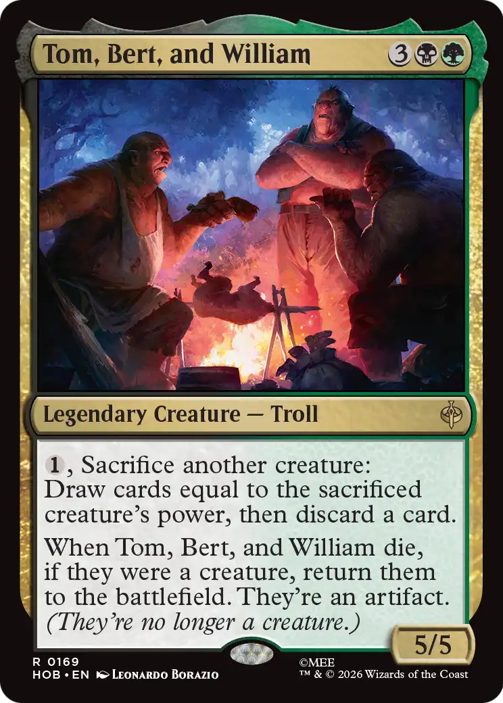
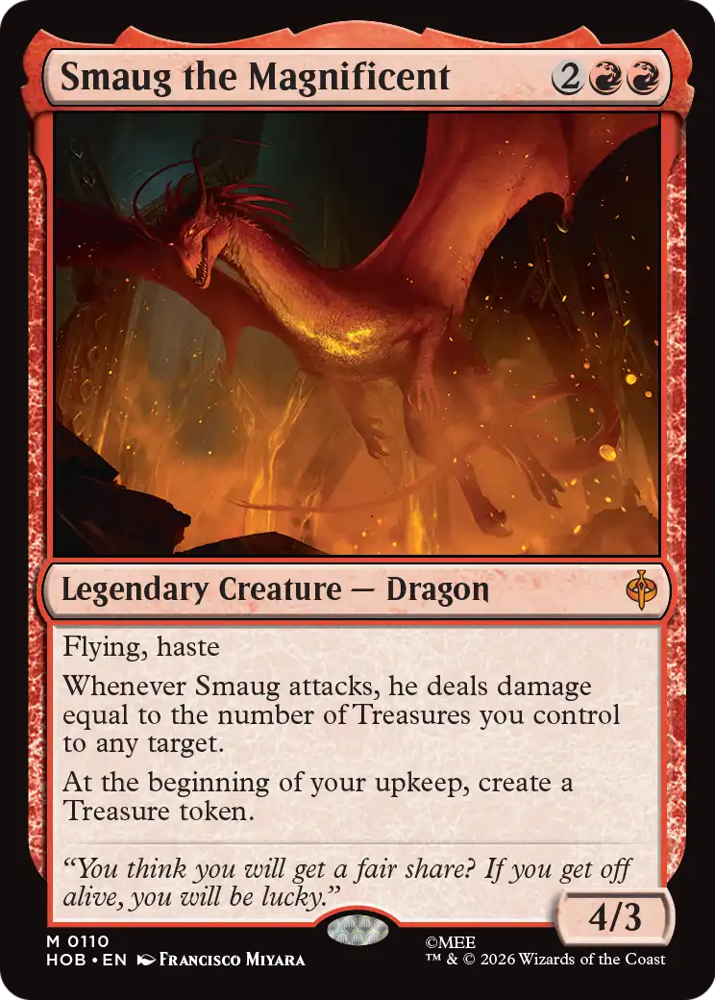
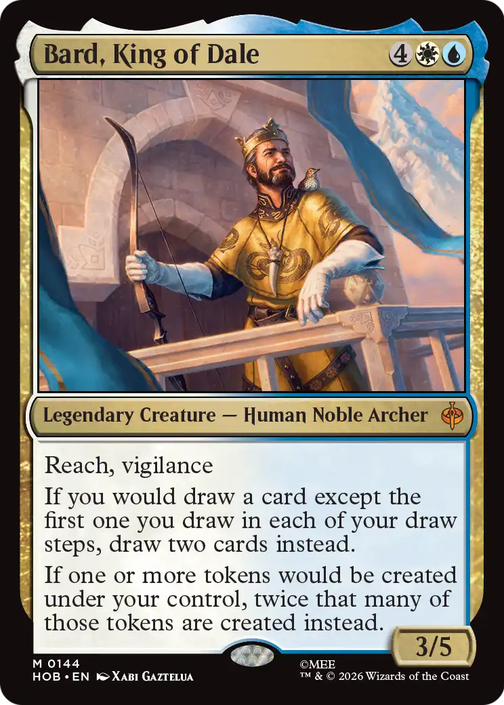
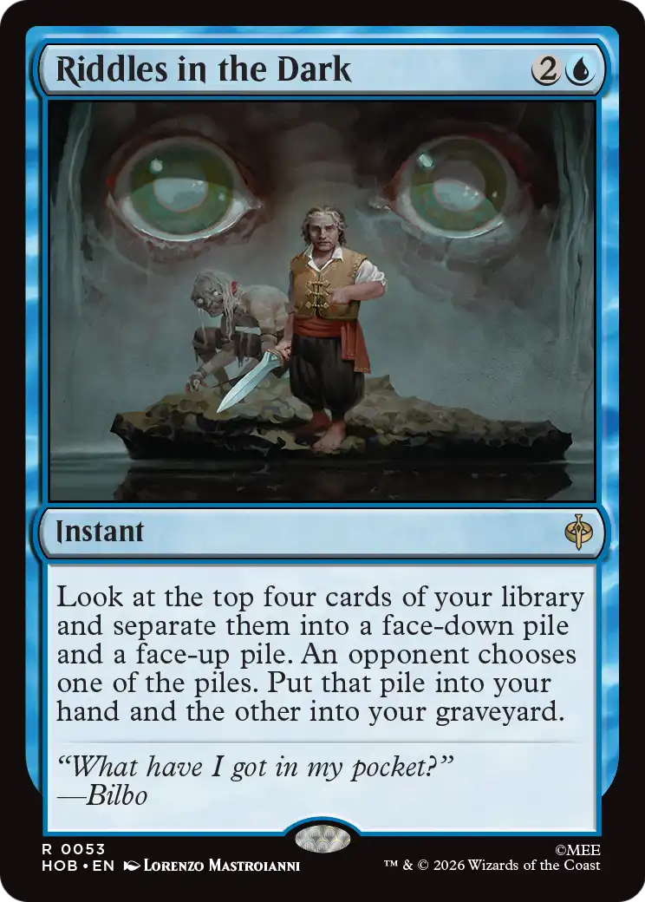

# scryfall-llm-sandbox

Experimental code for building a Magic: The Gathering card auto-tagger from Scryfall data and Scryfall Community tags.

## Setup

This project uses a standard Python dependency manifest: [`requirements.txt`](C:/Documents/GitHub/scryfall-llm-sandbox/requirements.txt).

A dependency manifest is just a machine-readable list of packages the project needs in order to run. In Python, the most common simple format is `requirements.txt`, which lets you install the environment with a single command.

Typical setup:

```bash
pip install -r requirements.txt
```

The manifest in this repo includes:

- notebook tooling, because notebooks are part of the intended workflow
- scraping dependencies
- model training dependencies
- Hugging Face and PyTorch dependencies

## Overview

This repository contains a project where DistilBERT (sourced from Hugging Face) has been fine tuned towards generating Scryfall Community style tags based on card text. This was achieved in two different approaches.  
  
The workflow for this approach is as follows:  
1. Download or load a large Scryfall bulk card dataset.  
2. Scrape the related Scryfall Community tag pages for card-level tags.
3. Reshape each card into a text format expected by the model (differs based on approach, explained below).
4. Build train, validation, and test datasets for a multi-label classification task.
5. Fine-tune a transformer model, currently centered on DistilBERT, using LoRA adapters.
6. Load the trained adapter and predict tags for unseen cards.

In practice, the project is focused less on generic LLM experimentation and more on a specific supervised tagging pipeline:

- source data: Scryfall bulk card data
- target labels: Scryfall Community tags
- task: multi-label classification
- primary model family: Hugging Face transformers
- current base model: `distilbert-base-uncased`

__NOTE:__ We are not __not__ training the model on every unique tag that appears in the Scryfall Community tags, but rather the top 300 most common (which account for the vast majority of tags present).  

## What The Model Learns

The model is trained to read a deliberately structured representation of a Magic card (two methods: one from the scryfall API, another from docling generated text) and predict a set of community-style functional tags.

## Model Performance Demo

### Summary 

The DistilBERT + LoRA classifier demonstrated stable convergence when fine-tuned on Docling-generated OCR text, reaching a validation loss of __0.145__ with no evidence of significant overfitting. Using a confidence threshold of __0.70__, the model achieved a __Macro F1 score of 0.475__ while maintaining a __Precision@5 of 67.1%__, meaning that approximately three to four of the top five predicted tags are correct on average. The model predicts an average of __5.2 tags per card__ compared to __4.5 true tags__, indicating good calibration despite the inherent noise introduced by OCR. Overall, these results show that the model is capable of generating accurate, high-quality tag recommendations from OCR-derived card text and provides a strong foundation for downstream automatic card annotation.

### Demo Versus Test Data  

Card Image | True Tags | Predicted Tags
----------|-----------|----------------
 | ['combat trick', 'protects-creature', 'regenerates other'] | ['protects-creature'] 
 | ['activated ability', 'burn any', 'deprecated legend type', 'pinger', 'repeatable crime', 'repeatable removal', 'unique type line'] | ['activated ability', 'bottomless mana sink', 'burn any', 'offcolor ability', 'pinger', 'repeatable crime', 'repeatable removal', 'type addition human']  
 | ['creaturefall', 'gains pp counters', 'intervening if clause', 'pp counters matter', 'unique type line'] | ['drawback', 'evasion', 'gains pp counters', 'pp counters matter', 'unique type line']  
 | ['evasion', 'rummage', 'triggered ability', 'virtual french vanilla'] | ['enters in company', 'rummage', 'triggered ability', 'virtual french vanilla', 'virtual vanilla']  
 | ['gains pp counters', 'namesake-spell', 'triggered ability'] | ['gains pp counters', 'namesake-spell', 'toll', 'triggered ability']  

#### Docling OCR Extracted Text: Example One

```txt
Wrap in Vigor

Instant

Regenerate each creature you control.

Some nature mages unknowingly took advantage of the temporal energies still swirling on Dominaria. What they mistook for healing magic was in fact the manipulation of time.
```

#### Docling OCR Extracted Text: Example Two

```txt
Falkenrath Celebrants

Creature - Vampire

Menace (This creature can't be blocked except l by two or more creatures.)

When Falkenrath Celebrants enters the battlefield, create two Blood "1, tokens. (They're artifacts with Discard a card, Sacrifice this artifact: Draw a card.")

4/4
```

### Demo Versus Net New Cards  

At the time of writing, The Hobbit set is actively being spoiled. This gives a fresh batch of cards that have not necessarily been tagged by the community yet. This is an example of how the model truly works.  

Card Image | Predicted Tags 
-----------|-----------------
 | ['death trigger', 'regrowth-creature', 'creaturefall', 'mana value matters']  
 | ['sacrifice outlet-creature', 'activated ability', 'burst draw', 'death trigger-self', 'power matters', 'synergy-artifact', 'pure draw']  
 | ['evasion', 'attack trigger', 'synergy-attacker-self', 'unique type line', 'repeatable creature tokens', 'alliteration', 'saboteur', 'repeatable crime']  
 | ['dnd character', 'alliteration', 'repeatable pure draw', 'repeatable creature tokens', 'draw engine']  
 | ['alliteration', 'single english word name', 'single target instant/sorcery', 'hand-positive\nAnnotation: +1', 'hand-positive']

## Text Preparation Approaches
  
### Approach One: Card Image to OCR Generated Text to Scryfall Tags (Recommended)  
  
This approach assumes we are starting from simply an image of the card, which is often the first and most accessible mode by which Magic Players are exposed to card. While this ensures the input data is consistent with how users would most likely engage with the model, it does represent a need for additional processing.  

Specifically, this approach introduces a need to convert a card image into semi structured text. For this, we employ the _docling model_ provided via the `docling` library. This step effectively replaces the preprocessing step performed in approach one (where we reshape the Scryfall API data into a standardized and highly structred text). The generated text from the docling dataset generator is then used to fine tune the model.

What docling outputs is semi-structured, in as far as the distinct regions of the card text are preserved. This winds up looking like the following structural example:
```txt
<Card Name>

<Type Line>

<Rules Text>

<Flavor Text> (if present)

<Power>/<Toughness> (if present)
```

### Approach Two: Structured Text to Scryfall Tags  

For this approach, we assume we have access to structured data provided via the Scryfall API. This increases the richness and quality of the data we can feed into a finetuning framework, but represents a greater challenge in making the model accessible to potential end users (who would be expected to provide text in the same highly structured way). Since we have the Scryfall API in this case, preparing the text dataset is simply a matter of restructuring the collection of data fields from the input file into a unified, standardized, and highly structured text file. 

The Scryfall API restructured text winds up being standardized to the following format:
```txt
<Card Name>
Mana Cost = <Mana Cost> (if present)  
Mana Value = <Mana Value> (if present)  
Type Line = <Type Line>  
Rules Text = <Rules Text>  
Power = <Power> (if present)  
Toughness = <Toughness> (if present)  
Loyalty = <Loyalty>  
Color Identity = <Color Identity>  
Rarity = <Rarity>  
```

The exact formatting matters. The data pipeline in [`src/data_gathering/`](C:/Documents/GitHub/scryfall-llm-sandbox/src/data_gathering) constructs the text in a consistent layout so training and inference use the same schema.

_Note: This approach was technically implemented first, but ultimately proved less accessible (even if it performed better)._

## Future Considerations  

At the time of writing (2026-07-29), I am calling this LLM fine tuning exercise to a close. I feel I have sufficiently explored how to implement a card_image-to-scryfall_tags model, and have explored several different implmentations of how to perform this.  

Right now the code is written to retrieve the data, fine tune a model, and evaluate the model performance against a withheld test set. There is also some rudimentary code written to use the model to generate tags for entirely never before seen card images. However, to properly scale this up and make the model accessible, the next major steps would be as follows:  
1. Formalize some code that accepts an image as an input, runs the image through docling to create OCR-generated text, and pass that text through the Scryfall Autotagger to generate tags.  
2. Take the collection of relevant code and expose it in an easy-to-use user interface. Bonus points if that user interface can except batches of cards at a time (in theory the Autotagger can already handle batches).  

---

## Repository Structure

### Core code

- [`src/config.py`](C:/Documents/GitHub/scryfall-llm-sandbox/src/config.py): central experiment settings for scraping, dataset building, task selection, model choice, and training parameters
- [`src/data_gathering/scryfall.py`](C:/Documents/GitHub/scryfall-llm-sandbox/src/data_gathering/scryfall.py): loads Scryfall bulk card data
- [`src/data_gathering/scryfall_scraper.py`](C:/Documents/GitHub/scryfall-llm-sandbox/src/data_gathering/scryfall_scraper.py): scrapes Scryfall Community tags and optionally downloads card art crops
- [`src/data_gathering/scryfall_dataset.py`](C:/Documents/GitHub/scryfall-llm-sandbox/src/data_gathering/scryfall_dataset.py): builds structured datasets for model training
- [`src/fine_tuning/fine_tune_multi_lab.py`](C:/Documents/GitHub/scryfall-llm-sandbox/src/fine_tuning/fine_tune_multi_lab.py): fine-tunes a transformer for multi-label classification
- [`src/fine_tuning/multi_lab_evaluator.py`](C:/Documents/GitHub/scryfall-llm-sandbox/src/fine_tuning/multi_lab_evaluator.py): evaluation helpers for threshold sweeps, top-k metrics, and hybrid scoring
- [`src/modeling/auto_tagger_multi_lab.py`](C:/Documents/GitHub/scryfall-llm-sandbox/src/modeling/auto_tagger_multi_lab.py): loads a fine-tuned adapter and predicts tags for new cards
- [`src/utils/`](C:/Documents/GitHub/scryfall-llm-sandbox/src/utils): support utilities such as retry logic and prediction debugging

### Data and artifacts

- [`data/`](C:/Documents/GitHub/scryfall-llm-sandbox/data): raw Scryfall data, generated datasets, and cached images
- [`reports/`](C:/Documents/GitHub/scryfall-llm-sandbox/reports): scraped tag outputs and training logs
- [`models/`](C:/Documents/GitHub/scryfall-llm-sandbox/models): saved fine-tuning outputs and checkpoints
- [`notebooks/`](C:/Documents/GitHub/scryfall-llm-sandbox/notebooks): exploratory and workflow notebooks
- [`scripts/`](C:/Documents/GitHub/scryfall-llm-sandbox/scripts): reproducible script entrypoints that mirror the two primary notebook workflows

## Canonical Run Order

The recommended workflow for this repo is now:

1. Install dependencies from [`requirements.txt`](C:/Documents/GitHub/scryfall-llm-sandbox/requirements.txt).
2. Put the Scryfall bulk card dump in [`data/oracle-cards.json`](C:/Documents/GitHub/scryfall-llm-sandbox/data/oracle-cards.json).
3. Set experiment parameters in [`src/config.py`](C:/Documents/GitHub/scryfall-llm-sandbox/src/config.py).
4. Scrape community tags and optional images.
5. Build the dataset splits.
6. Fine-tune the multi-label classifier (using either defined approach).
7. Load the saved adapter for inference and evaluation.

### Script-first workflow

1. Run [`scripts/scrape_scryfall.py`](C:/Documents/GitHub/scryfall-llm-sandbox/scripts/scrape_scryfall.py).
2. Run [`scripts/train_multi_label_classifier.py`](C:/Documents/GitHub/scryfall-llm-sandbox/scripts/train_multi_label_classifier.py).
3. Run [`scripts/run_pretrained_multi_label.py`](C:/Documents/GitHub/scryfall-llm-sandbox/scripts/run_pretrained_multi_label.py) to score withheld test cards or structured card text inputs with the pretrained adapter.

### Hugging Face metadata helper

If the Hugging Face repo contains only adapter artifacts, standalone inference
needs a small label metadata file alongside the adapter.

Use [`scripts/upload_hf_label_metadata.py`](C:/Documents/GitHub/scryfall-llm-sandbox/scripts/upload_hf_label_metadata.py) to reconstruct and upload:

- `n_labels`
- `id2label`
- `label2id`
- `unique_tags`

Once that file is uploaded as `label_metadata.json`, direct inference modes in
[`scripts/run_pretrained_multi_label.py`](C:/Documents/GitHub/scryfall-llm-sandbox/scripts/run_pretrained_multi_label.py) can run without loading the local dataset.

## Pipeline

### 1. Load card data

The pipeline starts with the Scryfall bulk card dump, typically `oracle-cards.json`.

[`src/data_gathering/scryfall.py`](C:/Documents/GitHub/scryfall-llm-sandbox/src/data_gathering/scryfall.py) reads that data into Python objects for downstream processing.

### 2. Scrape community tags

[`src/data_gathering/scryfall_scraper.py`](C:/Documents/GitHub/scryfall-llm-sandbox/src/data_gathering/scryfall_scraper.py) uses Selenium to:

- visit the Scryfall card page
- follow the link to the Scryfall Community tagger page
- extract the visible tags for the card
- optionally download the art crop image

The scraper filters out card types that are not relevant to the training objective, such as tokens and emblems.

### 3. Build the training dataset

[`src/data_gathering/scryfall_dataset.py`](C:/Documents/GitHub/scryfall-llm-sandbox/src/data_gathering/scryfall_dataset.py) merges:

- Scryfall bulk card data
- scraped community tags

It then reshapes each card into the text format expected by the model and writes train, validation, and test splits to `data/`.

While the repo contains code paths for several task formulations, the current intended use is:

- task: `multi_label_classification`

For that task, each example contains:

- `document`: the structured card text
- `tags`: the list of target labels

### 4. Fine-tune the model

[`src/fine_tuning/fine_tune_multi_lab.py`](C:/Documents/GitHub/scryfall-llm-sandbox/src/fine_tuning/fine_tune_multi_lab.py) handles:

- tokenization
- multi-hot label encoding
- class weighting
- LoRA adapter configuration
- Hugging Face training
- validation metrics

The current setup is aimed at fine-tuning `distilbert-base-uncased` for multi-label card tagging.

### 5. Run inference

[`src/modeling/auto_tagger_multi_lab.py`](C:/Documents/GitHub/scryfall-llm-sandbox/src/modeling/auto_tagger_multi_lab.py) loads:

- the base classification model
- the saved LoRA adapter
- the label mappings

It then predicts a ranked set of tags for a card based on the same structured text format used during training.

## Outputs

Typical generated outputs include:

- scraped tag JSON files in `reports/`
- train/validation/test dataset JSON files in `data/`
- downloaded art crops in `data/images/`
- training logs in `reports/`
- model checkpoints and adapters in `models/`

## Notes

- This repo is currently organized as an experiment workspace rather than a polished package.
- Notebooks are part of the working process and remain the primary development surface.
- The `scripts/` layer is intentionally thin and mirrors the active notebook logic rather than replacing it.
- Large generated artifacts may exist locally even if they are not intended to be committed long term.
- Some archived code remains in `src/_archives/` for reference.

## Future Improvements

Possible next steps for the project include:

- formalizing environment and dependency setup
- adding a reproducible training script or CLI entrypoint
- documenting dataset assumptions and tag cleanup rules in more detail
- adding evaluation summaries and example predictions to the repo
- comparing DistilBERT against larger encoder models

---

# OCR-Derived Card Text Fine Tuning Training Process

_NOTE: This is specific to the OCR Text Version_

Epoch | train_loss | val_loss | best_thresh | macro_f1 | p@5 | eval_runtime
------|------------|----------|-------------|----------|-----|--------------
Epoch 1 | train_loss=0.3798 | val_loss=0.3492 | best_thresh=0.10 | macro_f1=0.0321 | p@5=0.1757 | eval_runtime=7.0978
Epoch 2 | train_loss=0.3334 | val_loss=0.2920 | best_thresh=0.10 | macro_f1=0.0594 | p@5=0.2564 | eval_runtime=7.4033
Epoch 3 | train_loss=0.2656 | val_loss=0.2324 | best_thresh=0.30 | macro_f1=0.1557 | p@5=0.3586 | eval_runtime=7.5283
Epoch 4 | train_loss=0.2153 | val_loss=0.2030 | best_thresh=0.50 | macro_f1=0.2305 | p@5=0.4060 | eval_runtime=7.6522
Epoch 5 | train_loss=0.1848 | val_loss=0.1862 | best_thresh=0.50 | macro_f1=0.2852 | p@5=0.4365 | eval_runtime=9.3552
Epoch 6 | train_loss=0.1636 | val_loss=0.1736 | best_thresh=0.50 | macro_f1=0.3207 | p@5=0.4642 | eval_runtime=7.0761
Epoch 7 | train_loss=0.1476 | val_loss=0.1650 | best_thresh=0.70 | macro_f1=0.3532 | p@5=0.4770 | eval_runtime=7.4442
Epoch 8 | train_loss=0.1338 | val_loss=0.1581 | best_thresh=0.70 | macro_f1=0.3692 | p@5=0.4827 | eval_runtime=7.4512
Epoch 9 | train_loss=0.1233 | val_loss=0.1554 | best_thresh=0.70 | macro_f1=0.3888 | p@5=0.5020 | eval_runtime=8.1040
Epoch 10 | train_loss=0.1145 | val_loss=0.1496 | best_thresh=0.70 | macro_f1=0.4054 | p@5=0.5033 | eval_runtime=7.5624
Epoch 11 | train_loss=0.1070 | val_loss=0.1496 | best_thresh=0.70 | macro_f1=0.4151 | p@5=0.5176 | eval_runtime=7.0773
Epoch 12 | train_loss=0.0993 | val_loss=0.1466 | best_thresh=0.70 | macro_f1=0.4340 | p@5=0.5201 | eval_runtime=7.5128
Epoch 13 | train_loss=0.0932 | val_loss=0.1474 | best_thresh=0.70 | macro_f1=0.4413 | p@5=0.5248 | eval_runtime=7.4633
Epoch 14 | train_loss=0.0885 | val_loss=0.1446 | best_thresh=0.70 | macro_f1=0.4496 | p@5=0.5285 | eval_runtime=7.6448
Epoch 15 | train_loss=0.0846 | val_loss=0.1447 | best_thresh=0.70 | macro_f1=0.4584 | p@5=0.5320 | eval_runtime=7.4468
Epoch 16 | train_loss=0.0800 | val_loss=0.1448 | best_thresh=0.70 | macro_f1=0.4656 | p@5=0.5376 | eval_runtime=7.5346
Epoch 17 | train_loss=0.0768 | val_loss=0.1458 | best_thresh=0.70 | macro_f1=0.4682 | p@5=0.5383 | eval_runtime=7.5224
Epoch 18 | train_loss=0.0722 | val_loss=0.1452 | best_thresh=0.70 | macro_f1=0.4751 | p@5=0.5435 | eval_runtime=7.4464
Epoch 19 | train_loss=0.0693 | val_loss=0.1451 | best_thresh=0.70 | macro_f1=0.4753 | p@5=0.5448 | eval_runtime=7.4978